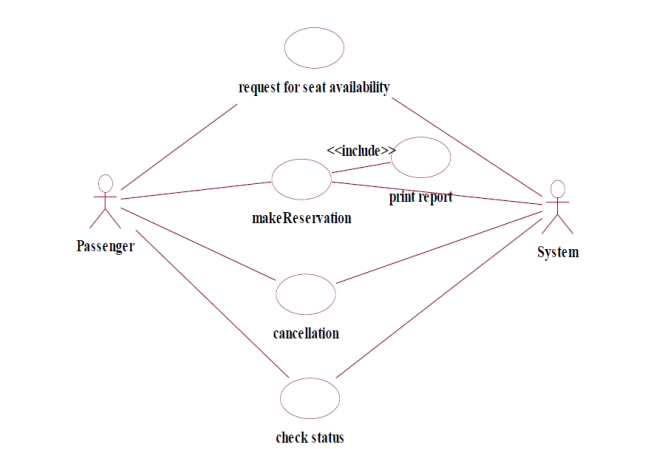
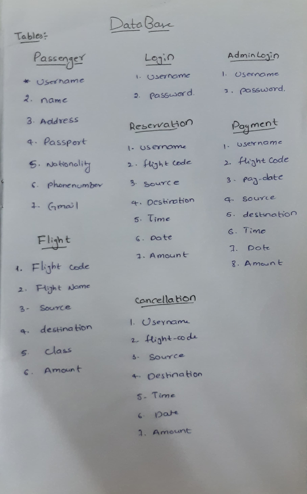
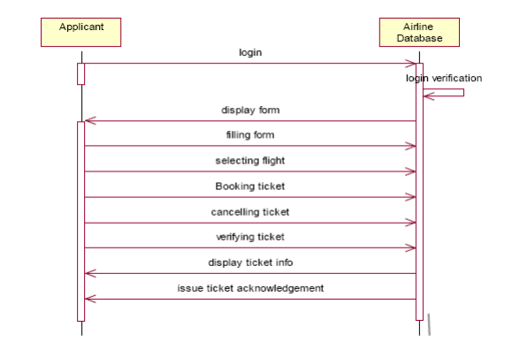
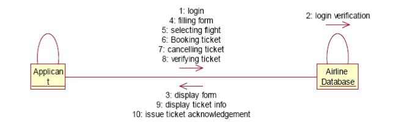
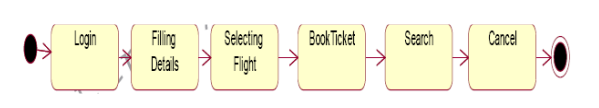
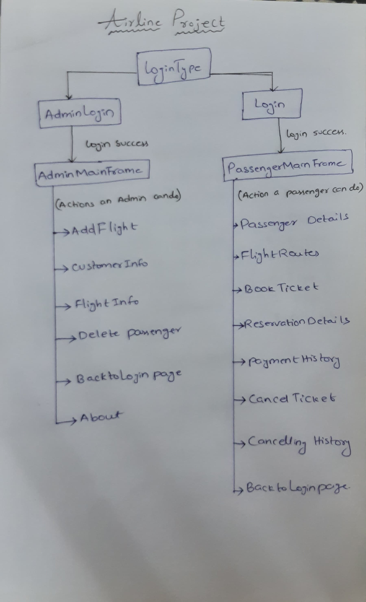
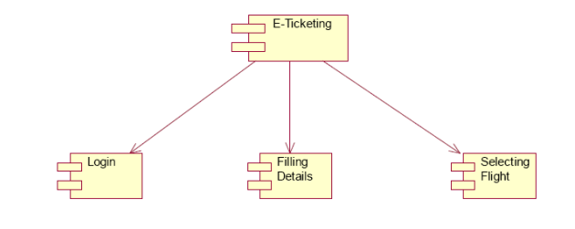

# Airline Reservation System

Welcome to the Airline Reservation System project! This Java-based desktop application aims to simplify the ticket booking process for airlines. Below you'll find a comprehensive overview of the project, including the technologies used, features, and instructions for setup and usage.

## Demo Video

<video width="640" height="360" controls>
  <source src="./assets/demo.mkv" type="video/mp4">
  <source src="./assets/demo.mkv" type="video/webm">
  Your browser does not support the video tag.
</video>

## Table of Contents

- [Introduction](#introduction)
- [Features](#features)
- [Project Discription](#project-discription)
- [Technologies Used](#technologies-used)
- [Installation](#installation)
- [Usage](#usage)
- [Contributing](#contributing)
- [License](#license)

## Introduction

The Airline Reservation System provides a user-friendly interface for passengers to book tickets, search for flights, and manage their reservations efficiently. It enhances the overall experience of both users and administrators by automating the ticket booking process and providing real-time flight information.

## Features

- **User Authentication:** Secure login system for passengers and administrators.
- **Ticket Booking:** Allows passengers to search for flights, select seats, and book tickets.
- **Flight Management:** Administrators can manage flight schedules, add new flights, and update existing ones.
- **Reservation Management:** Passengers can view, modify, and cancel their reservations.
- **Search Functionality:** Enables passengers to search for flights based on various criteria such as date, destination, and airline.

## Project Discription

The Airline Reservation System is a Java-based desktop application developed to streamline the ticket booking process for airlines. Users log in securely, provide personal details, select flights or trains, and finalize bookings. The system also offers additional features such as searching, cancel bookings, and secure payments. This README provides a comprehensive guide to understand the functionality, usability, performance, and reliability of the system.

## Problem Analysis and Project Planning

### Main Process

The primary process involves user authentication, providing personal details, selecting a flight, ticket booking, and additional functionalities such as searching for flights and canceling reservations.

### Project Planning

The project planning includes steps to ensure efficient database usage, user-friendly interfaces, optimal performance for multiple users, and a reliable system for processing user requests.

## Overall Description

### Functionality

The system functions as the main platform for e-ticketing, facilitating easy and efficient ticket booking.

### Performance

The system is designed to handle multiple users simultaneously without errors, ensuring efficient performance.

### Reliability

The system reliably processes user requests, providing a seamless experience.

## Use Case Diagram

### Overview

The use case diagram illustrates how passengers interact with the system. It includes functionalities such as viewing ticket status, confirming travel, and more.



## Class Diagram

### Classes

The system utilizes the following classes:

1. **TicketReservation**
2. **FlightInfo**
3. **PassengerInfo**
4. **PaymentInfo**



## Sequence Diagram

### Overview

The sequence diagram showcases the interaction between processes over time, representing different objects and their functions.



## Collaboration Diagram

### Overview

The collaboration diagram, also known as a communication diagram, displays roles, functionality, and behavior of individual objects and the system operation in real-time.



## State Chart Diagram

### Purpose

The state chart diagram helps understand the algorithm involved in performing a method, representing states and transitions.



## Activity Diagram

### Overview

Activity diagrams represent workflows of stepwise activities and actions. It shows the overall flow of control in the system.



## Component Diagram

### Purpose

The component diagram illustrates structural relationships between system components using boxed figures and communication associations.



## Technologies Used

- **Java:** Core programming language for backend logic and UI development.
- **JavaFX:** Framework for building rich client applications with Java.
- **MySQL:** Relational database management system for storing flight and passenger information.
- **JDBC:** Java Database Connectivity for interacting with the MySQL database.
- **Maven:** Build automation tool for managing project dependencies and building the project.
- **Git:** Version control system for tracking changes and collaborating with team members.
- **GitHub:** Hosting platform for storing the project repository and managing code contributions.

## Installation

To run the Airline Reservation System on your local machine, follow these steps:

1. Clone the repository to your local machine using Git:

```bash
git clone https://github.com/cnu1328/airline-reservation-system.git
```

2. Install Java Development Kit (JDK) version 8 or later if not already installed.

3. Install MySQL and create a database for the project.

4. Update the database configuration in the project to connect to your MySQL database.

5. Build the project using Maven:

```bash
mvn clean install
```

6. Run the application:

```bash
java -jar target/airline-reservation-system.jar
```

## Usage

1. Launch the application and log in as a passenger or administrator.
2. Passengers can search for flights, book tickets, and manage their reservations.
3. Administrators can manage flight schedules, add new flights, and view booking details.
4. Enjoy a hassle-free ticket booking experience!

## Contributing

Contributions are welcome! If you'd like to contribute to the project, please follow these guidelines:

1. Fork the repository and create your branch: `git checkout -b feature/my-feature`.
2. Commit your changes: `git commit -m 'Add my feature'`.
3. Push to the branch: `git push origin feature/my-feature`.
4. Submit a pull request detailing your changes.

## Result

The mini-project for the Airline Reservation System has been successfully executed, generating codes and achieving the desired functionalities.
